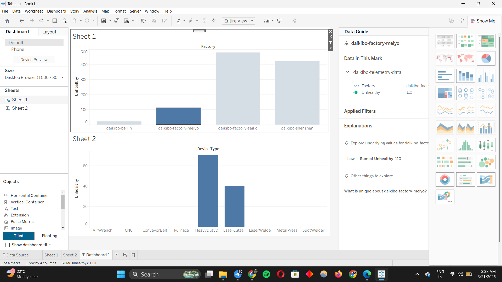
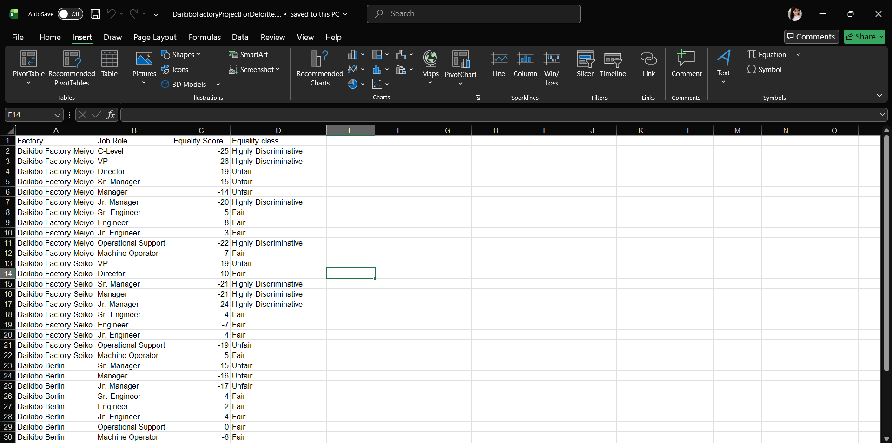
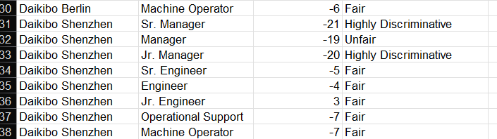

**​Deloitte Australia Data Analytics Virtual Internship**

​**Project: Daikibo Factory - Defective Device Analysis**

​**📊 Project Overview**

​This project was part of the Deloitte Australia Data Analytics Virtual Internship via Forage. The goal was to assist Daikibo, a large-scale manufacturing firm, in identifying why certain factory locations were producing more defective devices than others.
​
**🛠️ Tech Stack****

​Data Processing: Microsoft Excel (Cleaning & Preparation)
​Data Visualization: Tableau
​Documentation: Markdown

​**🔍 Data Engineering & Cleaning Process**
​Before the analysis, I performed the following ETL-style steps to ensure data integrity:
​Data Profiling: Identified missing values and inconsistent data types across factory logs.
​Data Transformation: Created new calculated columns to normalize "Defect Rates" across different production volumes.
​Quality Assurance: Validated that the data from the Excel source aligned correctly when imported into Tableau.

​**📈 Key Insights & Analysis**
​The analysis focused on identifying the correlation between factory location, device type, and defect frequency.
​1. Regional Performance:
### 📊** Tableau Dashboard**: Defective Device Trends and Defect Patterns:

​Identified specific "High-Risk" zones where the defect rate was significantly higher than the national average.

​Spotted a trend where specific hardware components had a 15% higher failure rate during peak production hours.
​💡 **Recommendation for Daikibo**
​Based on the dashboard, I recommended a targeted audit of the [mention a specific area you found, like the assembly line or a specific region] to reduce waste and improve production ROI.
​🚀 Future Data Engineering Roadmap
​To make this project more "Production Ready," I plan to:
​Automate the Pipeline: Use Python (Pandas) to automate the data cleaning process currently done in Excel.
​Database Integration: Move the .xlsx data into a PostgreSQL database to simulate a real-world data warehouse environment.
​Real-time Monitoring: Connect the Tableau dashboard to a live data source for real-time defect tracking.

​📊** Task 2: Diversity & Inclusion Audit (Excel)**

​While analyzing factory defects, I also conducted a Gender Equality Audit across three main factory locations: Meiyo, Seiko, and Berlin.
​Analysis Methodology:
### 📉 Gender Equality Audit - Factory Workforce

### 🧮 Equality Score Classification

​Metric: Used the "Equality Score" (ranging from negative to positive) to determine the fairness of promotions and pay across different job roles (C-Level, VP, Engineers, etc.).
​Categorization: Developed a classification system in Excel to label roles as "Fair," "Unfair," or "Highly Discriminative" based on the score variance.
​Findings from the Data:
​Leadership Gap: The data revealed that higher-level roles (VP, Director, C-Level) in the Meiyo and Seiko factories showed "Highly Discriminative" scores, suggesting a lack of gender diversity in top management.
​Operational Fairness: Interestingly, lower-level technical roles like Junior Engineers and Machine Operators mostly fell into the "Fair" category across all locations.
​🛠️ Technical Skills Demonstrated (Excel) ​🧮 Excel Logic Used
​To automate the classification of the Equality Class based on the Equality Score, I used a nested IF statement. This ensured that every job role was audited consistently across all factories: =IF(C2 <= -20, "Highly Discriminative", IF(C2 <= -10, "Unfair", "Fair"))
The Logic Breakdown:
​Score \leq -20: Categorized as Highly Discriminative (Critical priority for HR).
​Score between -10 and -19: Categorized as Unfair (Needs investigation).
​Score >-10: Categorized as Fair (Acceptable range).
​Conditional Logic: Used nested IF statements or VLOOKUP to automatically assign the Equality Class based on the numeric Equality Score.
​Data Categorization: Grouped complex organizational hierarchies to identify patterns in corporate inequality.
